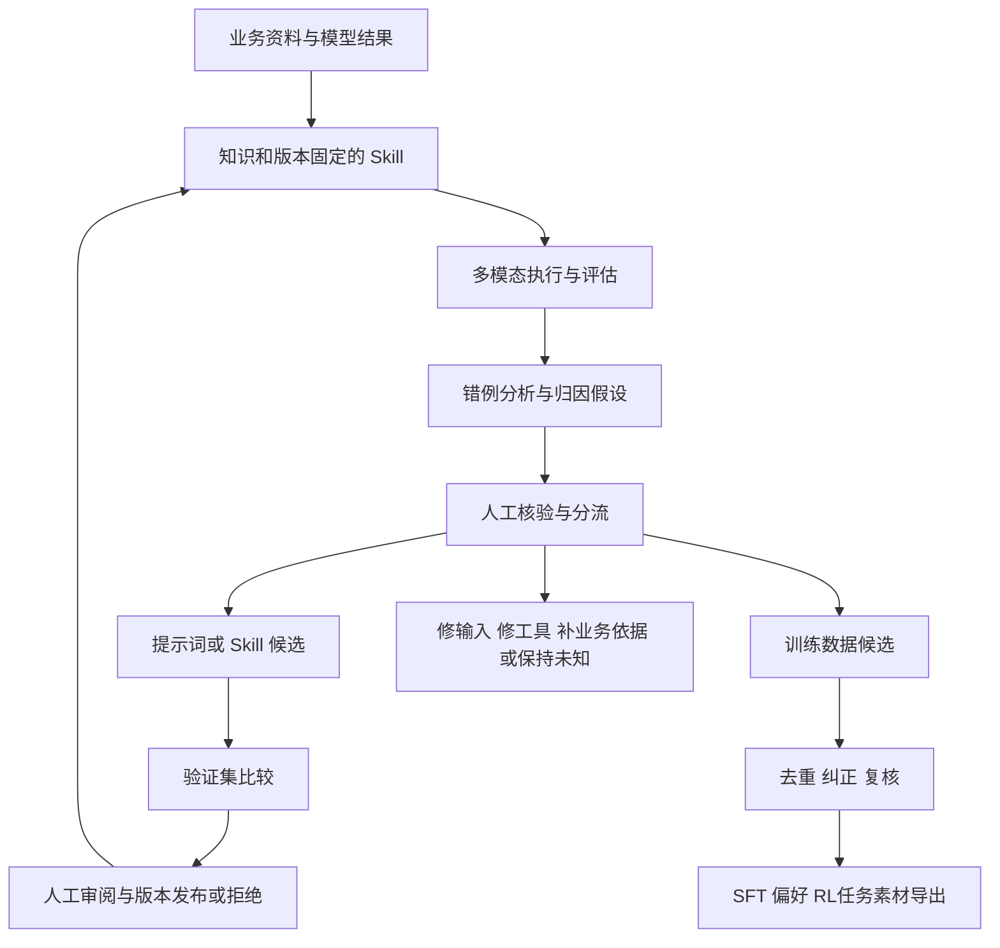

# 业务模型迭代 Agent：课程落地设计与目录

更新：2026-09-13，已纳入学习者确认的算法工程背景、业务 Skill/多模态优化/训练数据目标与时间条件。本版替代最初的“代码审查 Agent”设想；新课件尚未实现。

## 1. 课程的中心问题

**如何把业务经验变成可复用的 Skill，再用真实案例、人工反馈与可复核的评测，让 Agent 持续改进业务执行，并产出有价值的后训练数据？**

课程围绕“业务模型迭代助手”展开。LangGraph 提供执行、暂停恢复和流程组合；Skill 承载可定制的方法；评测驱动优化；人工审核处理业务判定和不确定性。主线共 10 个能力单元，安排在 8 周内，4 周先交付一条最小闭环。详细课表见 [curriculum.md](curriculum.md)，目标与取舍见 [learning-goals.md](learning-goals.md)，术语见 [CONTEXT.md](../CONTEXT.md)。

| 原材料 | 保留 | 根据目标调整 |
| --- | --- | --- |
| [DESIGN.md](DESIGN.md) | 原语、执行过程可见、确定性机制实验 | 机制实验用 fake，业务验收必须有真实模型证据 |
| [旧课程路线](archive/curriculum-langgraph-baseline.md) | 状态→控制流→checkpoint→interrupt 的依赖 | 基础压缩到 L1–L3；基础子图作为业务流程组合进入 L4/L8 |
| [补充调研](lesssons-specify-draft.md) | 工具、上下文、评测、治理等工程视野 | 加入业务 Skill、自优化、多模态归因及数据生产；复杂基础设施按需扩展 |

Python 和大模型原理采用诊断后补缺。沿用现有 Poetry、L1 和 MLflow，避免因更换工具占用主线时间。

## 2. 两条业务工作流，共用知识与证据



最终留出测试只在冻结候选后验收，不作为循环反馈。发现新问题后若继续优化，须重新说明留出集已被使用并准备新的独立验证范围。

流程一是“评估—归因—优化—审阅”；流程二是“发现—筛选—纠正—导出”。开始时用固定图和少数子图表达，Skill 在节点中被显式加载。基本组合能力先做成两个可运行流程；动态生成任意业务流程不是首版前置。

不是所有错例都适合改 prompt。例如输入缺了目标页，应修正选页；业务规则相互矛盾，应先确认依据；没有可信答案的结果只能送核验。一个案例也可能同时需要改规则说明、修输入和补训练样本，分流记录可多选。

## 3. 目标目录结构

以下除已标“已有/本次新增”外均为待开发结构。按课程需要逐步创建，不生成空课件，也不迁移 L1 路径。

```text
agent-learning/
├── README.md                          # 当前运行入口与课程导航（已有）
├── CONTEXT.md                         # 业务术语及边界（本次新增）
├── docs/
│   ├── learning-goals.md              # 已确认目标与建议交付范围（本次新增）
│   ├── curriculum.md                  # 当前 L1–L10 路线与八周安排（本次更新）
│   ├── course-implementation.md       # 本设计
│   ├── DESIGN.md                      # 原机制课程设计；带适用范围说明
│   ├── learning-log.md                # 预测、错因、迁移与每周复盘（计划）
│   ├── lesssons-specify-draft.md       # 已有调研草稿，原文保留
│   ├── references/                    # 已有背景研究
│   └── archive/
│       └── curriculum-langgraph-baseline.md # 旧路线工作区原文（本次保存）
├── lessons/
│   ├── l1_state_node_edge/            # 已有：原语与执行机制
│   ├── l2_agent_loop/                 # 控制流、工具、真实模型、最小观测
│   ├── l3_durable_review/             # checkpoint、interrupt、人工审核
│   ├── l4_business_skills/            # 业务知识、Skill、基础子图组合
│   ├── l5_multimodal_evaluation/       # 图文证据、任务评价与数据分组
│   ├── l6_failure_attribution/         # 错例、归因假设与对照实验
│   ├── l7_prompt_optimization/         # 反思基线与现成优化器
│   ├── l8_skill_evolution/            # Skill 可优化组件、版本与复用
│   ├── l9_training_data_mining/       # 挖掘、人工纠正和不同训练用途
│   └── l10_capstone/                  # 综合验收，不复制项目实现
├── project/                           # L2 起逐课积累的唯一业务实现
│   ├── README.md
│   ├── main.py                        # 选择流程/配置并运行
│   ├── schemas.py                     # 运行、案例、反馈、候选、审核记录
│   ├── workflows/
│   │   ├── improve.py                 # 评估→归因→候选→审阅
│   │   └── mine_data.py               # 发现→核验→纠正→导出
│   ├── skill_runtime.py               # 发现/加载/检查/调用，固定版本
│   ├── knowledge.py                   # 来源、规则查找、冲突与更新
│   ├── review.py                      # 审核队列与恢复
│   ├── model_io.py                    # 图文输入输出、usage 与 fake/live
│   ├── optimization.py                # 优化器适配，复用既有搜索实现
│   ├── data_mining.py                 # 样本优先级、去重与多格式导出
│   └── tests/                         # 跨模块与流程行为验证
├── business_skills/                   # 被课程 Agent 加载的业务资产（计划）
│   ├── README.md                      # 运行时 Skill 格式与生命周期
│   ├── analyze_failures/
│   ├── optimize_prompt/
│   └── curate_training_data/
├── knowledge/                         # 有版本和来源的业务依据（计划）
│   ├── rules/                         # 规则、术语、适用范围与依据
│   └── cases/                         # 已核验的代表案例
├── evals/                             # 评价逻辑与实验报告（计划）
│   ├── task_metrics.py                # 业务结果、证据与分组指标
│   ├── run.py                         # 基线/候选与 fake/live 分开
│   └── reports/                       # 精简比较报告和失败证据索引
├── datasets/                          # 案例与集合清单（计划）
│   ├── README.md                      # 来源、分组、版本和用途
│   ├── fixtures/                      # 可共享小型图文样例
│   ├── manifests/                     # 原始文件引用、摘要、集合划分
│   └── reviewed/                      # 审核后样本清单，按数据条件管理
├── extensions/                        # MCP、缓存、部署、实际后训练接入（计划）
├── lib/                               # 已有机制观测与 MLflow 辅助
├── artifacts/                         # 运行时 trace/候选/审核/导出，后续忽略入库
├── docker-compose.yml                 # 已有本地 MLflow
└── pyproject.toml                     # 已有依赖管理
```

`business_skills/` 是运行时业务资产，与已有 `.agents/skills/` 的开发辅助技能分开。L4 用最小元数据、说明、示例及工具声明验证加载行为，再决定格式兼容范围。目录出现 Skill 不会使 LangGraph 自动发现或执行它。

每个业务 Skill 初版可由 `skill.yaml`（名称、版本、输入输出、知识引用、允许工具、可优化字段）、`instructions.md`、`examples/` 组成。这是教学格式建议；需要与其他 Skill 格式互通时写适配器。首版不自动改工具代码和依赖；L8 先优化明确声明的说明/示例/步骤，代码演化作为后续独立实验。

模块随课次添加：L2 只有入口、模型 I/O 和一个流程，L4 才有 Skill/知识模块，L7 才有优化器，L9 才有挖掘导出。`lessons/` 是小实验，`project/` 是累积实现，`evals/` 是评价逻辑，`datasets/` 是案例与分组信息。L10 引用项目，避免第二份综合代码。

## 4. 业务知识沉淀与上下文

知识记录包含来源、业务范围、规则版本、确认状态及代表案例。自动提取先产生候选，人工确认后进入可引用知识。发生冲突时保留双方依据和适用时间；旧版本继续服务旧运行回放，新任务选择新版本。

首版采用显式规则 ID 与标签检索即可，重点验证“知识更新→Skill 加载→模型输入→业务结果”实际生效。规模需要时再引入检索索引。checkpoint 保存任务进度，不能代替业务知识库；模型反思也不能自行修改被用于判定答案的业务依据。

上下文工程贯穿 L4–L7：只加载本任务需要的规则和案例；限制长工具结果；保留原图、页码/区域、关键说明与可回查引用。压缩实验必须检查遗漏规则和视觉信息，单纯 token 减少不算成功。

## 5. 多模态错例与归因设计

案例最小记录建议包含：`case_id`、来源分组、图像/页/区域引用与内容摘要、输入预处理版本、问题、业务规则版本、模型标识与参数、Skill/prompt 版本、原始输出、评分/人工判定及 trace 引用。多图顺序、分辨率、裁剪与 OCR/选页配置要能复现。

分析输出为“错误现象、归因假设、引用证据、建议动作、核验状态”。初始类别：输入损坏或缺失、选证据错误、视觉识别错误、规则或标签歧义、提示词未表达要求、工具/流程错误、疑似模型能力不足及未知。多标签允许共存。

归因靠小型干预增强证据：固定指令更换正确输入，固定图像只修改一条指令，固定输出重新人工判定，或用正确证据页做受控对照。“给定正确证据时可答对”只能支持局部判断，仍需实际选证据的端到端测试；模型失败也不能单凭一次结果判定必须 SFT/RL。

人工队列至少展示输入证据、模型输出、规则依据、建议及修改记录，并支持接受、改写、驳回、未知/升级核验。首版用 CLI 和本地审核记录，后续再考虑标注界面。

## 6. 自动提示词优化与 Skill 自迭代

GEPA 官方说明其可优化文本形式的产物，也列出 VLM/OCR/文档理解应用。本课程据此选择它作为首个现成优化器；具体业务是否受益由实验决定，框架支持不等于已验证本项目效果。[GEPA FAQ](https://gepa-ai.github.io/gepa/guides/faq/)

最小实现顺序：

1. 固定业务任务、业务规则、模型、输入处理与评价器，记录初始提示词及预算。
2. 做简单的一轮“失败反馈→候选提示词→复跑”基线，理解反馈接口。
3. 用同一执行与评分接口接 GEPA，限制候选数/评测调用/费用/时间，记录 proposer 与业务模型各自成本。选定库版本后再锁定具体 API。
4. 在相同验证样本上比较基线与候选，报告总结果及关键业务类别的退化。小批次可用于筛选，晋升要看声明的完整验证范围。
5. 冻结选定候选，做最终留出评估。接受、拒绝和无收益停止都是合理结果，不为了“自优化”强行发布。
6. L8 才将候选从 prompt 扩展到 Skill 的说明、示例和步骤；每轮记录具体改了哪部分，业务依据和评价标准单独管理。

搜索集用于产生反馈，验证集用于选择，最终测试集不进入候选生成；同文档、同客户/来源或近重复内容按业务选择合适的分组单位，不能把同一图像的裁剪分到不同集合。用于优化的数据与后训练数据也要检查来源重叠。

多模态反馈保留必要视觉证据；若反思模型能看图，记录实际给它看的图像与区域；若只能读文本，记录转写的信息损失。第一轮保持图像预处理固定，后续再单独比较裁剪、选页或输出结构，避免一次修改所有变量而无法解释收益。

发布记录关联父版本、变更、业务知识版本、数据集合、评价器版本、结果与人工结论。一次运行固定其版本，不能在恢复时静默换成“最新 Skill”。

## 7. 训练数据挖掘与后训练接口

先从离线导出的线上记录或模型结果开始：原始记录→候选发现→同源/近重复去重→按多样性和业务价值排序→人工核验纠正→分用途导出。线上连接器不是首版前置，也不以模型自报置信度作为唯一选择依据。

| 用途 | 必须补充的内容 | 不能直接推断的结论 |
| --- | --- | --- |
| SFT | 图文输入、经核验的目标回答、业务依据与审核记录；检查目标模型图像处理/模板 | 把失败答案或未经检查的反思文本当成正确监督 |
| 偏好优化 / Reward Modeling | 相同输入下的候选回答、可靠的偏好关系、判定理由；平局/证据不足另存 | 所有偏好对都适合所有 RL 算法，或偏好高即绝对正确 |
| 可验证 RL 任务（以 GRPO 类实验为例） | 输入/环境、可核验参考或奖励逻辑、必要工具反馈；设计投机答案反例测试奖励 | 有 chosen/rejected 就完成 GRPO 数据准备，或格式奖励提高就等于业务能力提高 |

TRL 分别定义 SFT、偏好训练与 prompt-only 训练的数据类型；视觉样本还需要正确的图像和消息组织。导出器应面向选定训练器版本验证，通用 JSONL 只是中间表示。[数据格式](https://huggingface.co/docs/trl/dataset_formats)、[GRPOTrainer](https://huggingface.co/docs/trl/grpo_trainer)

被选中的样本须能追溯原输入、模型输出、筛选原因、人工修改和目的集合。排除仅因重复、标签不可靠或没有可恢复证据而产生的“难例”；保留必要正常样本和业务分布覆盖。用同等审核额度比较随机抽样和 Agent 推荐的有效样本数、类别覆盖与人工耗时，小规模试验只报告观察结果。

主线交付经审核的数据包和格式/图像加载验证；实际训练扩展接入作业 ID、模型版本、训练配置及训练后评价结果。没有真实训练结果时，不把“数据更好”写成已证实的模型提升。

## 8. 实验和有效学习的验收

L2 用少量样本建立 I/O 和固定基线；L5 建议先整理约 30–60 个可核验案例，按来源分组并覆盖正常/异常/歧义。数量是工作量起点，不是统计充分性承诺；样本不足时先证明机制，补数据后再判断泛化。

每份报告记录成功数/总数、业务分组表现、证据是否正确、重复运行次数、时间和真实 usage。优化同时统计被拒绝候选及失败开销。模型评分需用人工审阅样本校准，不能让候选改变评价口径来“提高分数”。

至少完成这些产品行为实验：

- 审核中重启，拒绝/修改正常恢复，结果不被重复应用。
- 候选改善某类任务却损害关键规则时被拒绝；无收益时正常停止。
- 业务知识更新后新任务生效，旧任务仍固定原版本并可解释。
- 无可靠标签时进入核验队列，原始错误输出不能直接入 SFT。
- 同一图的裁剪/同源文档不跨搜索与留出集合；导出素材可加载且有审核来源。
- 学习者独立增加一个业务规则或 Skill，并检查加载到评测的完整路径。

每课保留 `README.md + main.py + test_main.py`，有需要才加 live 实验。机制测试断言行为，真实任务实验验证业务结果，学习者迁移验证掌握程度。原始 chunk/trace 保留，允许用摘要辅助阅读；摘要不能替代证据。

## 9. 原稿校正与内容迁移

| 旧内容 | 新位置或处理 |
| --- | --- |
| 原 L1 / 调研 W1 | 保留路径；校正“纯函数”、调度/汇聚等简化表述；补调用次数证据 |
| 原 L2 / 调研 W2 | L2 循环/真实工具；Send 在 L4/L8 按流程需要学习；复杂调度扩展 |
| 原 L3–L4 / 调研 W3、W5 | L3 集中学习持久化与人工审核；MCP/Postgres 留扩展 |
| 原 L5 / 调研 W6 | 基础子图在 L4/L8 主线；复杂 supervisor 和多 Agent 比较扩展 |
| 调研 W4、W7 | 上下文、可观测、评测贯穿 L2–L9；不等到最后才引入 |
| 原 L6 / 调研 W8 | L2 起累积唯一 project，L10 验收；面试按需 |
| 本轮明确的业务目标 | L4 Skill/知识、L5 多模态、L6 归因、L7–L8 优化、L9 数据工作流 |

保留上版发现的校正项：

- Node 的纯函数是教学简化；真实调用存在副作用。并发输出顺序可能变化，确定性结果不等于每行日志顺序固定。
- 普通多入边与显式等待多个源的汇聚应区分；L1 当前名为“运行两次”的测试未直接断言调用次数。
- `interrupt()` 恢复会重跑节点前段；多个 interrupt 不是框架禁用项，调用顺序需要稳定；“每节点一个”只能作为入门约定。[官方说明](https://docs.langchain.com/oss/python/langgraph/interrupts)
- checkpoint 不自动使外部副作用恰好一次；测试写操作之后、完成记录之前的崩溃窗口。历史分叉也不自动撤销外部操作。
- `Command` 将更新与路由写在同一返回中，不默认证明性能收益或外部事务原子性；与静态边并存时要验证额外路径。[官方说明](https://docs.langchain.com/oss/python/langgraph/graph-api)
- 前缀哈希不能直接证明真实缓存收益；固定压缩水位线、费用倍数、Planning 完成率和通用 mutation score 都需限定场景。
- 调研中 `[cite: 9]` 等编号与参考列表不对应；正式课件使用具体论断→精确来源→本地实验，不搬运未核验引用。

本地 lock 记录 LangGraph 1.2.11，且当前被忽略入库。课件开发时补可复现版本记录并以已安装 API 核验联网文档，不在目录设计阶段升级依赖。

本次更新目标、术语、主线和目录；旧 curriculum 已按修改前的工作区全文保存。DESIGN 和调研保留背景并标出适用范围，L1/MLflow 代码与原有未提交修改不迁移。后续按 W1 开始逐课开发；具体业务样本选择只影响模型适配、评价和案例，不影响上述目录职责。
